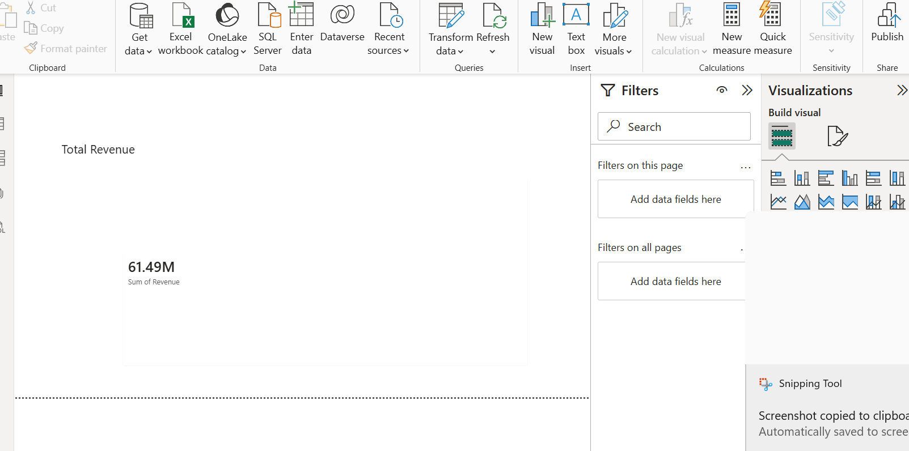

# Retail Sales Performance Analysis & Optimization

## Project Overview
This project analyzes retail sales data using MySQL and Power BI to identify business insights, customer behavior, sales trends, product performance, and optimization opportunities.

The project follows a real-world data analyst workflow:

- Data collection
- Data cleaning
- SQL analysis
- Data modeling
- Dashboard creation
- Business insights generation

---

## Tools Used

- MySQL
- Power BI
- SQL
- Excel
- GitHub

---

## Dataset Information

The dataset contains three tables:

### Customers Table
Contains customer information:

- Customer_ID
- Customer_Name
- Gender
- Income_Level
- Customer_Segment
- Registration_Date

### Products Table
Contains product details:

- Product_ID
- Product_Name
- Category
- Brand
- Cost_Price
- Selling_Price
- Discount_Percentage
- Rating
- Stock_Available

### Orders Table
Contains transaction details:

- Order_ID
- Customer_ID
- Product_ID
- Quantity
- Revenue
- Profit
- Payment_Method
- Delivery_Type
- Order_Date
- Delivery_Days

---

## SQL Analysis Performed

### Customer Analysis

- Customers with highest orders
- Customer purchase behavior
- Customer segmentation

### Product Analysis

- Top-selling products
- Product revenue analysis
- Product profit analysis
- Product rating analysis

### Sales Analysis

- Monthly sales trend
- Category sales performance
- Brand sales performance

### Inventory Analysis

- Low stock products
- Fast moving products

---

## Power BI Dashboard

Dashboard includes:

### KPI Cards

- Total Revenue
- Total Orders

### Visualizations

1. Top Selling Products
2. Sales by Category
3. Brand-wise Sales Performance
4. Monthly Sales Trend
5. Customer Age Purchase Analysis
6. Payment Method Distribution
7. Delivery Type Distribution
8. Product Rating vs Sales Analysis
9. Discount Impact on Sales

---

## Dashboard Screenshots

### Revenue KPI

### Orders KPI

### Top Selling Products

### Sales by Category

### Brand Sales Performance

### Monthly Sales Trend

### Customer Age Analysis

### Payment Method Distribution

### Delivery Type Distribution

### Product Rating Analysis

### Discount Impact Analysis

---

## Business Insights

- Electronics category generated highest sales.
- LG achieved highest overall brand sales.
- Laptop V6 showed strong revenue contribution.
- Standard delivery was preferred by most customers.
- Debit Card was the most used payment method.
- Sales peaked during October.
- Product ratings positively influenced sales performance.

---

## Project Outcome

This project demonstrates practical data analyst skills:

- SQL querying
- Database management
- Data modeling
- Dashboard building
- Business problem solving
- Data visualization

---

## Author

Sai Kumar
